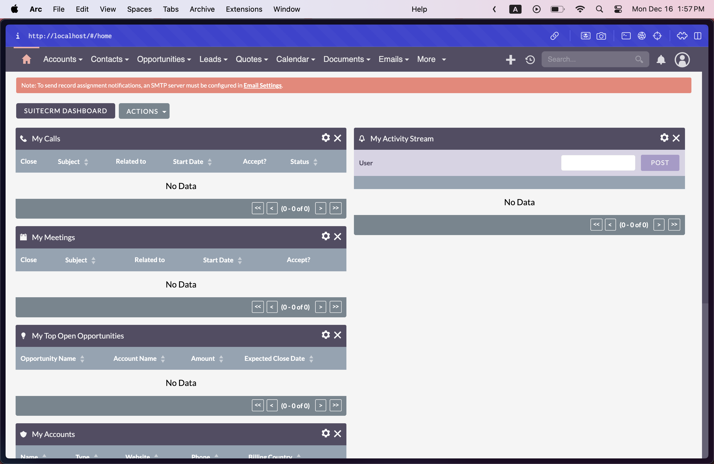

# Table of Contents

1. [Getting Started](#getting-started)
2. [API Routes](#api-routes)
   - [Authentication](#authentication)
   - [SuiteCRM](#suitecrm)
   - [SnipeIt](#snipeit)
   - [HelpDesk]()
3. [SuiteCRM](#suitecrm)
   - [Standalone Setup](#initial-setup)
   - [API Configuration](#api-configuration)
4. [SnipeIt](#snipeit)
5. [HelpDesk](#helpdesk)
6. [Docker Compose]()

# Getting Started

In order to quickly spin up each of the microservices, please follow the commands below.

```
docker compose up -d
```

Once your containers are successfully up, you can now access your services.

# API Routes

Here are the complete list of API routes to the microservices available through the custom API Gateway.

> [!NOTE]
> All routes are **ONLY ACCESSIBLE** if the user is authenticated. Please authenticate user first before accessing any API endpoints for all microservices.

## Authentication

Here are the complete list of API routes for basic user authentication using JSON Web Tokens (JWT). We prepared basic users for the demo which is stored in memory.

There are two (2) available users for demo purposes in showcasing Role-Based Access Control (RBAC). These are users: `admin` and `user`. `admin` can access all routes while `user` can only access select routes. Here are their credentials for testing purposes.

Call the `/login` route using either of the request bodies below.

```
{
  "username": "admin",
  "password": "achille"
}
```

```
{
  "username": "user",
  "password": "achille"
}
```

The base URL is `http://localhost:3000/auth` which is the endpoint for authenticating our users.

| **Route**   | **Method** | **Description**                        | **Authorization** |
| ----------- | ---------- | -------------------------------------- | ----------------- |
| `/login`    | `POST`     | Authenticate a user and log them in.   | ❌                |
| `/logout`   | `POST`     | Log the user out of the application.   | ✅                |
| `/generate` | `POST`     | Generate a hashed password for a user. | ❌                |

### Notes

- Ensure that the appropriate roles are assigned to users to access restricted routes.
- Rate limiting is applied to prevent abuse of the API endpoints.

Once you're authenticated, you can proceed to calling all the routes below.

## SuiteCRM

This document provides an overview of the API routes available in the SuiteCRM module, including their descriptions and methods.

The base URL is `http://localhost:3000/suitecrm` which is the endpoint for the API Gateway for all SuiteCRM routes.

> [!NOTE]
> The base API endpoint used to proxy the user's requests to SuiteCRM is `http://localhost:8000/legacy/Api/V8/<params>` where `params` are the different modules allowed given by SuiteCRM's OpenAPI specifications.

| **Route**       | **Method** | **Description**                                    | **Authorization** |
| --------------- | ---------- | -------------------------------------------------- | ----------------- |
| `/accounts`     | `POST`     | Create a new user account.                         | `Admin`           |
| `/accounts`     | `GET`      | Retrieve a list of all user accounts.              | `Admin`           |
| `/accounts/:id` | `GET`      | Retrieve details of a specific user account by ID. | `User` `Admin`    |
| `/accounts`     | `PATCH`    | Update an existing user account.                   | `Admin`           |
| `/accounts`     | `DELETE`   | Delete a user account.                             | `Admin`           |
| `/oauth2/token` | `POST`     | Obtain an OAuth2 token for authentication.         | ❌                |

### Notes

- Ensure that the appropriate roles are assigned to users to access restricted routes.
- Rate limiting is applied to prevent abuse of the API endpoints.

## SnipeIt

This document provides an overview of the API routes available in the SnipeIt module, including their descriptions and methods.

The base URL is `http://localhost:3000/snipeit` which is the endpoint for the API Gateway for all SnipeIt routes.

> [!NOTE]
> The base API endpoint used to proxy the user's requests to SuiteCRM is `http://localhost:8001/api/v1/<params>` where `params` are the different resources allowed given by SnipeIt's OpenAPI specifications.

| **Route**           | **Method** | **Description**                                    | **Authorization** |
| ------------------- | ---------- | -------------------------------------------------- | ----------------- |
| `/stocks`           | `GET`      | Retrieve a list of all stock items.                | `User` `Admin`    |
| `/stocks/:id`       | `GET`      | Retrieve details of a specific stock item by ID.   | `User` `Admin`    |
| `/stocks/:id`       | `PATCH`    | Update an existing stock item by ID.               | `Admin`           |
| `/stocks/:id`       | `DELETE`   | Delete a stock item by ID.                         | `Admin`           |
| `/stocks`           | `POST`     | Create a new stock item.                           | `Admin`           |
| `/statuslabels`     | `GET`      | Retrieve a list of all status labels.              | `User` `Admin`    |
| `/statuslabels/:id` | `GET`      | Retrieve details of a specific status label by ID. | `User` `Admin`    |
| `/statuslabels/:id` | `PATCH`    | Update an existing status label by ID.             | `Admin`           |
| `/statuslabels/:id` | `DELETE`   | Delete a status label by ID.                       | `Admin`           |
| `/statuslabels`     | `POST`     | Create a new status label.                         | `Admin`           |
| `/users`            | `GET`      | Retrieve a list of all users.                      | `Admin`           |
| `/users/:id`        | `GET`      | Retrieve details of a specific user by ID.         | `User` `Admin`    |
| `/users`            | `POST`     | Create a new user account.                         | `Admin`           |
| `/users/:id`        | `PATCH`    | Update an existing user account by ID.             | `Admin`           |
| `/users/:id`        | `DELETE`   | Delete a user account by ID.                       | `Admin`           |

### Notes

- Ensures that the appropriate roles are assigned to users to access restricted routes.
- Rate limiting is applied to prevent abuse of the API endpoints.

## HelpDesk

> [!NOTE]
> The base API endpoint used to proxy the user's requests to the HelpDesk is `http://localhost:3001/tickets`.

| **Route**      | **Method** | **Description**                              | **Authorization** |
| -------------- | ---------- | -------------------------------------------- | ----------------- |
| `/tickets`     | `GET`      | Retrieve a list of all tickets.              | `User`, `Admin`   |
| `/tickets`     | `POST`     | Create a new ticket.                         | `User`, `Admin`   |
| `/tickets/:id` | `GET`      | Retrieve details of a specific ticket by ID. | `User`, `Admin`   |
| `/tickets/:id` | `PUT`      | Update an existing ticket by ID.             | `User`, `Admin`   |
| `/tickets/:id` | `DELETE`   | Delete a ticket by ID.                       | `Admin`           |

### Notes

- Ensures that the appropriate roles are assigned to users to access restricted routes.
- Rate limiting is applied to prevent abuse of the API endpoints.

# SuiteCRM

## Standalone Setup

This setup of SuiteCRM utilizes Bitnami's help through the use of Docker public/suitecrm/images. This will be how we can setup a standalone version of SuiteCRM, meaning, only SuiteCRM and no other microservices.

### Pull the Bitnami SuiteCRM public/suitecrm/image

```
docker pull bitnami/suitecrm
```

### Create compose.yaml

Create a docker `compose.yaml` file inside your root directory.

After creating the file, paste the code [here](https://github.com/bitnami/containers/blob/main/bitnami/suitecrm/docker-compose.yml) into your `compose.yaml` file. This will be the configuration that Docker will use in order to build and spin up your SuiteCRM container.

This is what your `compose.yaml` should look like after copying the code of Bitnami's SuiteCRM compose file.


### Run SuiteCRM container

This will run and build your SuiteCRM container in **detached** mode. The flag `-d` allows the container to run in your terminal while still allowing you to run commands in the same terminal tab.

```
docker compose up --build -d
```

Your terminal should look something like this afterwards.


> **TIP:** For more information about the different options available for `docker compose up`, execute the command `docker compose up --help` to see the list of available _options_.

### Confirm the running containers

Confirm if your containers are running. You can either:

- Use _Docker desktop_ to view if your containers are properly running.


- Run the `docker ps` command inside your terminal while inside your root directory (or where the `compose.yaml` file is located at). This command will show you if your containers are running.


If you have finally confirmed that your Docker containers (_Mariadb_ and _SuiteCRM_), then we can open SuiteCRM itself.

### Open SuiteCRM in your browser

Enter the URL below into your web browser and wait for SuiteCRM to open up. _(port may vary depending on what was configured in the .env file `SUITECRM_EXTERNAL_HTTP_PORT_NUMBER`)_

```
localhost:8000
```

You will be greeted by a login screen.


For more information on the environment variables to be used, which aids in the changing of user credentials, view more [here](https://hub.docker.com/r/bitnami/suitecrm#environment-variables)! Bitnami will guide you on the different customizable environment variables.

Login with the following **default** credentials:

Username: `user`<br>
Password: `bitnami`

## API Configuration

### Generating RSA Keys

SuiteCRM uses key cryptography in order to encrypt and decrypt, as well as verify the integrity of signatures, so this step is **important.**

#### Navigate inside your Docker Container root directory

```
docker exec -it 49fbe1440555 bash
```

After running the command above, you should be inside your Docker container's **root** directory using BASH (Bourne Again Shell).


The basic syntax/parameters of the command above is `docker exec -it <container-id | name> bash` where you would replace this parameter using your container's ID or its name.

To view your Docker containers' information, run `docker ps`


#### Navigate to SuiteCRM OAuth2 directory

```
cd ./bitnami/suitecrm/public/legacy/Api/V8/OAuth2
```

You'll know you're inside your Docker container when your terminal will look something like this.


When you're inside the OAuth2 directory, do the following:

**Generate key and change key permissions**

```
openssl genrsa -out private.key 2048 && openssl rsa -in private.key -pubout -out public.key && chmod 600 private.key public.key && chown daemon:daemon p*.key
```

After that you're set for executing API calls through SuiteCRM's API Endpoints.

### Obtaining an OAuth2 Session

When you successfully login to SuiteCRM via the default credentials: Username `user` and Password `bitnami`, you will be greeted by the home page like this below.



A grant type in authentication, particularly within the OAuth 2.0 framework, refers to the method by which a client application **obtains an access token** from an authorization server. SuiteCRM supports two _Grant Types._ These are `Client Credentials Grant` and `Password Grant`

For simplicity, we will be using `Client Credentials` as our grant type for obtaining an access token. Without our access token, we won't be authenticated and authorized to make API calls through SuiteCRM's exposed API endpoints.

#### Navigate to Admin tab via Dropdown


At the top right of the navbar, hover your mouse over at the profile icon. This will show a dropdown menu which showcases several tabs. Click on **Admin.**

#### Click "OAuth2 Clients and Tokens"


#### Click "New Client Credentials..."


#### Fill out new Client Credentials


If you intend on putting a **secret,** make sure to remember it. However, inputting a secret is **OPTIONAL.**

Click **Save** when you're ready. After creating your new client credentials, you should now have access to your newly created client's ID like below.


Keep the `Client ID` in mind as we will use this in the next step.

#### Getting an Access Token


> [!NOTE]
> I am using Bruno, a Git-integrated, fully offline, and open-source API client, so the User Interface (UI) might look a bit different for you. However, the flow should more or less be the same if you're using something like Postman. For more information about Bruno, click [here](https://www.usebruno.com/).

1. Configure to use OAuth 2.0
2. Select Grant Type `Client Credentials`
3. Access Token URL should be `http://localhost:<port-number>/legacy/Api/access_token`
4. `Client ID` should be your newly created client's client ID. Refer [here](public/suitecrm/image-16.png).
5. `Client Secret` should be the secret that you configured during the creation of your new client credential. (OPTIONAL)
6. Click **Get Access Token** and you should be sent a JSON like the picture above.

#### Get the complete SuiteCRM API documentation


1. Navigate to the `Auth` section again.
2. Configure a `GET` request with the API endpoint `http://localhost:<port-number>/legacy/Api/V8/meta/swagger.json`
3. Set to `Bearer Token`
4. Enter your newly created `Access Token` from the [previous request](public/suitecrm/image-15.png).
5. Click send. You will receive the whole list of configurable API endpoints from SuiteCRM.

> [!TIP]
> In order to easily view the API documentation, you can choose to save the outputted JSON and open it in your browser so you have more space to view all the listed API endpoints.

Congratulations! You're now ready to use SuiteCRM's APIs.

# SnipeIt

# HelpDesk
